# NSAttributedString

<!-- create time: 2014-11-25 01:10:42  -->

    NSAttributedString管理一个字符串，以及与该字符串中的单个字符或某些范围的字符串相关的属性。
    比如这个字符串“我爱北京天安门”，“我”跟其他字符的颜色不一样，而“北京”与其他的字体和大小不一样，等等。
    NSAttributedString就是用来存储这些信息的，具体实现时，NSAttributedString维护了一个NSString，用来保存最原始的字符串，另有一个NSDictionary用来保存各个子串/字符的属性。

[iOS之富文本](http://www.itnose.net/detail/6177538.html)

##文字显示

	在iOS中或者Mac OS X中怎样才能将一个字符串绘制到屏幕上呢？
	简单来说，是通过控件来完成的，而这些控件都封装在UIKit框架中（对于Mac OS X是AppKit框架）在UIKit中常用来在屏幕上显示字符串的控件有3个：
        UILabel
        UITextField
        UITextView
		
	然而这些控件本身对文本的展现方式很单一，通常仅仅能够控制字体样式、大小、颜色、加粗、斜体等等，而对于行距控制，字距控制，段落控制等高级功能却无能为力。
	
	CoreText框架是基于 iOS 3.2+ 和 OSX 10.5+ 的一种能够对文本格式和文本布局进行精细控制的文本引擎。它良好的结合了 UIKit 和 Core Graphics/Quartz：
		
		UIKit 的 UILabel 允许你通过在 IB 中简单的拖曳添加文本，但你不能改变文本的颜色和其中的单词。
	    Core Graphics/Quartz几乎允许你做任何系统允许的事情，但你需要为每个字形计算位置，并画在屏幕上。
		
	然而，CoreText.framework本身非常庞大，学习成本较高，使用起来也不是很方便，所以一般不是特殊需要，很少会有人去使用它。

	随着iOS6 API的发布，文字显示的API越来越完善，其中一个重要的更新是在UITextField，UITextView和UILabel中加入了对AttributedString的支持，实现行距控制，字距控制，段落控制等高级功能也不必再去使用深奥的CoreText框架。
	
	而iOS7的发布，苹果又引入了TextKit,TextKit是一个快速而又现代化的文字排版和渲染引擎。
	TextKit并没有新增类，只是在原有的文本显示控件上进行了封装，可以在平时我们最喜欢使用的UILabel，UITextField，UITextView等控件里面使用，其最主要的作用就是为程序提供文字排版和渲染的功能。
	苹果引入TextKit的目的并非要取代已有的CoreText框架，虽然CoreText的主要作用也是用于文字的排版和渲染，但它是一种先进而又处于底层技术，如果我们需要将文本内容直接渲染到图形上下文(Graphics context)时，从性能和易用性来考虑，最佳方案就是使用CoreText。
	而如果我们需要直接利用苹果提供的一些控件(如UITextView、UILabel和UITextField等)对文字进行排版，那么借助于UIKit中TextKit提供的API无疑更为方便快捷。
	TextKit在文字处理方面具有非常强大的功能，并且开发者可以对TextKit进行定制和扩展。
	据悉，苹果利用了2年的时间来开发TextKit，相信这对许多开发者来说都是福音。
	
	
##NSAttributedString
	
与NSString类似，在iOS中AttributedString也分为NSAttributedString和NSMutableAttributedString，不同的是，AttributedString对象多了一个Attribute的概念，一个AttributedString的对象包含很多的属性，每一个属性都有其对应的字符区域，在这里是使用NSRange来进行描述的。 使用AttributedString的方式通常有两种：
	
方式一:

	首先初始化一个NSMutableAttributedString，然后向里面添加文字样式，最后将它赋给控件的AttributedText，该方法适合于文本较少而又需要分段精细控制的情况。

	NSString *originStr = @"Hello,中秋节！";

    //方式一

    //创建 NSMutableAttributedString
    NSMutableAttributedString *attributedStr01 = [[NSMutableAttributedString alloc] initWithString: originStr];

    //添加属性

    //给所有字符设置字体为Zapfino，字体高度为15像素
    [attributedStr01 addAttribute: NSFontAttributeName value: [UIFont fontWithName: @"Zapfino" size: 15]
                                                       range: NSMakeRange(0, originStr.length)];
    //分段控制，最开始4个字符颜色设置成蓝色
    [attributedStr01 addAttribute: NSForegroundColorAttributeName value: [UIColor blueColor] range: NSMakeRange(0, 4)];
    //分段控制，第5个字符开始的3个字符，即第5、6、7字符设置为红色
    [attributedStr01 addAttribute: NSForegroundColorAttributeName value: [UIColor redColor] range: NSMakeRange(4, 3)];

    //赋值给显示控件label01的 attributedText
    _label01.attributedText = attributedStr01;
	
运行结果:
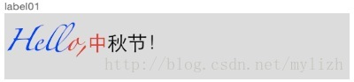

方式二:

	//方式二

    //创建属性字典
    NSDictionary *attrDict = @{ NSFontAttributeName: [UIFont fontWithName: @"Zapfino" size: 15],
                               NSForegroundColorAttributeName: [UIColor blueColor] };

    //创建 NSAttributedString 并赋值
    _label02.attributedText = [[NSAttributedString alloc] initWithString: originStr attributes: attrDict];

	

运行结果:
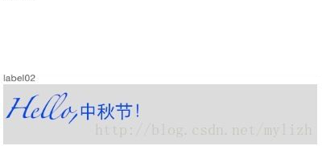

	//方式二的分段处理
    //第一段
    NSDictionary *attrDict1 = @{ NSFontAttributeName: [UIFont fontWithName: @"Zapfino" size: 15],
                                 NSForegroundColorAttributeName: [UIColor blueColor] };
    NSAttributedString *attrStr1 = [[NSAttributedString alloc] initWithString: [originStr substringWithRange: NSMakeRange(0, 4)] attributes: attrDict1];
    
    //第二段
    NSDictionary *attrDict2 = @{ NSFontAttributeName: [UIFont fontWithName: @"Zapfino" size: 15],
                                 NSForegroundColorAttributeName: [UIColor redColor] };
    NSAttributedString *attrStr2 = [[NSAttributedString alloc] initWithString: [originStr substringWithRange: NSMakeRange(4, 3)] attributes: attrDict2];
    
    //第三段
    NSDictionary *attrDict3 = @{ NSFontAttributeName: [UIFont fontWithName: @"Zapfino" size: 15],
                                 NSForegroundColorAttributeName: [UIColor blackColor] };
    NSAttributedString *attrStr3 = [[NSAttributedString alloc] initWithString: [originStr substringWithRange:
                                                                                NSMakeRange(7, originStr.length - 4 - 3)] attributes: attrDict3];
    //合并
    NSMutableAttributedString *attributedStr03 = [[NSMutableAttributedString alloc] initWithAttributedString: attrStr1];
    [attributedStr03 appendAttributedString: attrStr2];
    [attributedStr03 appendAttributedString: attrStr3];
    
    _label03.attributedText = attributedStr03;
	
	
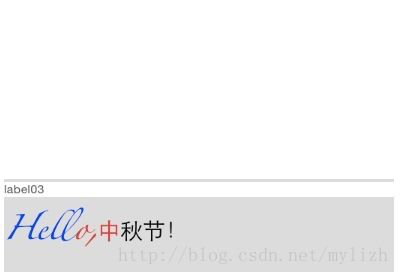	

###AttributedString可以设置属性

	// NSFontAttributeName                设置字体属性，默认值：字体：Helvetica(Neue) 字号：12
	// NSForegroundColorAttributeNam      设置字体颜色，取值为 UIColor对象，默认值为黑色
	// NSBackgroundColorAttributeName     设置字体所在区域背景颜色，取值为 UIColor对象，默认值为nil, 透明色
	// NSLigatureAttributeName            设置连体属性，取值为NSNumber 对象(整数)，0 表示没有连体字符，1 表示使用默认的连体字符
	// NSKernAttributeName                设定字符间距，取值为 NSNumber 对象（整数），正值间距加宽，负值间距变窄
	// NSStrikethroughStyleAttributeName  设置删除线，取值为 NSNumber 对象（整数）
	// NSStrikethroughColorAttributeName  设置删除线颜色，取值为 UIColor 对象，默认值为黑色
	// NSUnderlineStyleAttributeName      设置下划线，取值为 NSNumber 对象（整数），枚举常量 NSUnderlineStyle中的值，与删除线类似
	// NSUnderlineColorAttributeName      设置下划线颜色，取值为 UIColor 对象，默认值为黑色
	// NSStrokeWidthAttributeName         设置笔画宽度，取值为 NSNumber 对象（整数），负值填充效果，正值中空效果
	// NSStrokeColorAttributeName         填充部分颜色，不是字体颜色，取值为 UIColor 对象
	// NSShadowAttributeName              设置阴影属性，取值为 NSShadow 对象
	// NSTextEffectAttributeName          设置文本特殊效果，取值为 NSString 对象，目前只有图版印刷效果可用：
	// NSBaselineOffsetAttributeName      设置基线偏移值，取值为 NSNumber （float）,正值上偏，负值下偏
	// NSObliquenessAttributeName         设置字形倾斜度，取值为 NSNumber （float）,正值右倾，负值左倾
	// NSExpansionAttributeName           设置文本横向拉伸属性，取值为 NSNumber （float）,正值横向拉伸文本，负值横向压缩文本
	// NSWritingDirectionAttributeName    设置文字书写方向，从左向右书写或者从右向左书写
	// NSVerticalGlyphFormAttributeName   设置文字排版方向，取值为 NSNumber 对象(整数)，0 表示横排文本，1 表示竖排文本
	// NSLinkAttributeName                设置链接属性，点击后调用浏览器打开指定URL地址
	// NSAttachmentAttributeName          设置文本附件,取值为NSTextAttachment对象,常用于文字图片混排
	// NSParagraphStyleAttributeName      设置文本段落排版格式，取值为 NSParagraphStyle 对象
	
1. 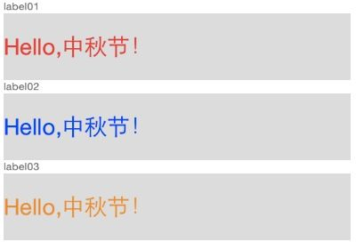  NSForegroundColorAttributeNam

		NSForegroundColorAttributeName设置的颜色与UILabel的textColor属性设置的颜色在地位上是相等的，谁最后赋值，最终显示的就是谁的颜色。

2. 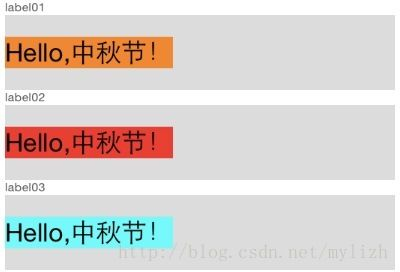  NSBackgroundColorAttributeName

		NSForegroundColorAttributeName 和 NSBackgroundColorAttributeName 的地位是相等的，跟前面介绍的 textColor 一样，哪个属性最后一次赋值，就会冲掉前面的效果

		但是textColor属性可以与 NSBackgroundColorAttributeName 属性叠加

3. 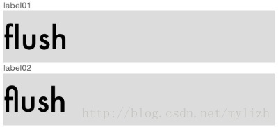  NSLigatureAttributeName

4. 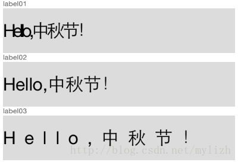  NSKernAttributeName

5. 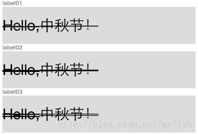 NSStrikethroughStyleAttributeName 

		// NSUnderlineStyleNone   不设置删除线
	    // NSUnderlineStyleSingle 设置删除线为细单实线
	    // NSUnderlineStyleThick  设置删除线为粗单实线
	    // NSUnderlineStyleDouble 设置删除线为细双实线
		
6. 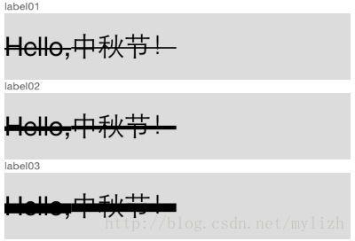 NSStrikethroughStyleAttributeName

		删除线属性取值除了上面的4种外，其实还可以取其他整数值，有兴趣的可以自行试验，取值为 0 - 7时，效果为单实线，随着值得增加，单实线逐渐变粗，
		取值为 9 - 15时，效果为双实线，取值越大，双实线越粗。
		
7. 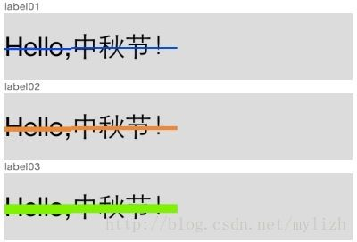 NSStrikethroughColorAttributeName+NSStrikethroughStyleAttributeName

8. 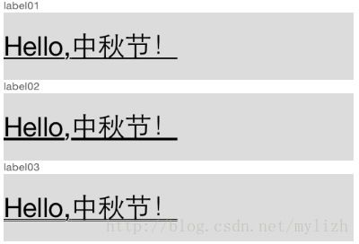 NSUnderlineStyleAttributeName

9. 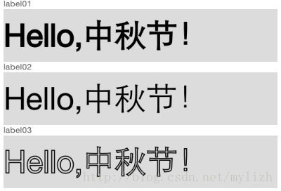 NSStrokeWidthAttributeName

		NSStrokeWidthAttributeName 设置笔画宽度，取值为 NSNumber 对象（整数），负值填充效果，正值中空效果

10. 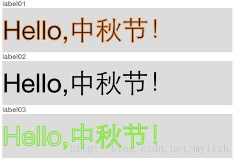 NSStrokeColorAttributeName

		NSStrokeColorAttributeName 填充部分颜色，不是字体颜色
		上面并没有设置字体的颜色，所以所有字体颜色应该是黑色
		
11. 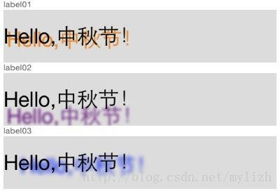 NSShadowAttributeName

	    //NSShadowAttributeName 设置阴影属性，取值为 NSShadow 对象

		NSShadow *shadow1 = [[NSShadow alloc] init];  //NSShadow 对象比较简单，只有3个属性：阴影颜色，模糊半径和偏移
        shadow1.shadowOffset = CGSizeMake(3, 3);      //阴影偏移（X方向偏移和Y方向偏移）
        shadow1.shadowBlurRadius = 0.5;               //模糊半径
        shadow1.shadowColor = [UIColor orangeColor];  //阴影颜色
		
12. 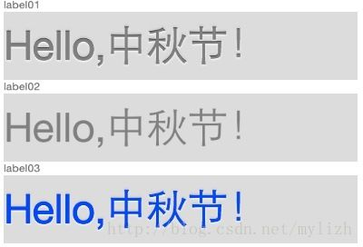	NSTextEffectAttributeName

		 设置文本特殊效果，取值为 NSString 对象，目前只有一个可用的特效：
		 //NSTextEffectLetterpressStyle（凸版印刷效果），适用于iOS 7.0及以上
		 
13. 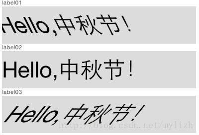	NSObliquenessAttributeName

		设置字形倾斜度，取值为 NSNumber （float）,正值右倾，负值左倾
		
14. 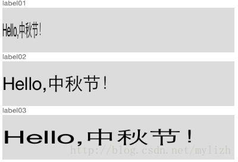 NSExpansionAttributeName

		设置文本横向拉伸属性，取值为 NSNumber （float）,正值横向拉伸文本，负值横向压缩文本

15. 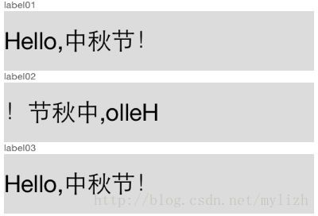 NSWritingDirectionAttributeName

		// 设置文字书写方向，取值为以下组合

	    //@[@(NSWritingDirectionLeftToRight | NSTextWritingDirectionEmbedding)]
	    //@[@(NSWritingDirectionLeftToRight | NSTextWritingDirectionOverride)]
	    //@[@(NSWritingDirectionRightToLeft | NSTextWritingDirectionEmbedding)]
	    //@[@(NSWritingDirectionRightToLeft | NSTextWritingDirectionOverride)]
		
16. 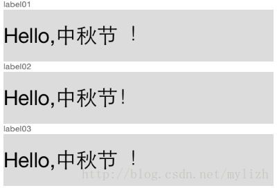 NSVerticalGlyphFormAttributeName

		设置文字排版防线，取值为 NSNumber 对象(整数)，0 表示横排文本，1 表示竖排文本。
		//  在 iOS 中，总是使用横排文本，0 以外的值都未定义

17. 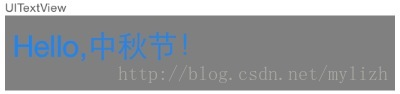 NSLinkAttributeName

		// 设置链接属性，点击后调用浏览器打开指定URL地址
		
		- (BOOL)textView:(UITextView *)textView shouldInteractWithURL:(NSURL *)URL inRange:(NSRange)characterRange{
		    NSLog(@"textView is clicked...");
		    return YES;
		}
		
18. 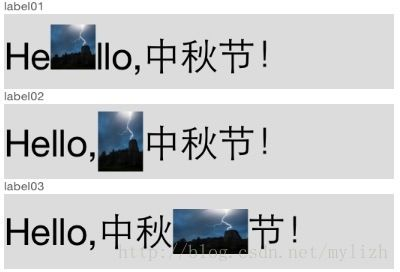 NSAttachmentAttributeName

			//NSAttachmentAttributeName 设置文本附件,取值为NSTextAttachment对象,常用于文字图片混排
    
		    NSTextAttachment *textAttachment01 = [[NSTextAttachment alloc] init];
		    textAttachment01.image = [UIImage imageNamed: @"10000.jpeg"];  //设置图片源
		    textAttachment01.bounds = CGRectMake(0, 0, 30, 30);          //设置图片位置和大小
		    NSMutableAttributedString *attrStr01 = [[NSMutableAttributedString alloc] initWithString: originStr];

		    [attrStr01 addAttribute: NSFontAttributeName value: [UIFont systemFontOfSize: 25] range: NSMakeRange(0, originStr.length)];
		    NSAttributedString *attrStr11 = [NSAttributedString attributedStringWithAttachment: textAttachment01];
    
		    [attrStr01 insertAttributedString: attrStr11 atIndex: 2];  //NSTextAttachment占用一个字符长度，插入后原字符串长度增加1
    
		    _label01.attributedText = attrStr01;

    
		    NSTextAttachment *textAttachment02 = [[NSTextAttachment alloc] init];
		    textAttachment02.image = [UIImage imageNamed: @"10000.jpeg"];  //设置图片源
		    textAttachment02.bounds = CGRectMake(0, -10, 30, 40);          //设置图片位置和大小
		    NSMutableAttributedString *attrStr02 = [[NSMutableAttributedString alloc] initWithString: originStr];
    
		    [attrStr02 addAttribute: NSFontAttributeName value: [UIFont systemFontOfSize: 25] range: NSMakeRange(0, originStr.length)];
		    NSAttributedString *attrStr12 = [NSAttributedString attributedStringWithAttachment: textAttachment02];
    
		    [attrStr02 insertAttributedString: attrStr12 atIndex: 6];
    
		    _label02.attributedText = attrStr02;
    
		    NSTextAttachment *textAttachment03 = [[NSTextAttachment alloc] init];
		    textAttachment03.image = [UIImage imageNamed: @"10000.jpeg"];  //设置图片源
		    textAttachment03.bounds = CGRectMake(0, -6, 50, 30);          //设置图片位置和大小
		    NSMutableAttributedString *attrStr03 = [[NSMutableAttributedString alloc] initWithString: originStr];
    
		    [attrStr03 addAttribute: NSFontAttributeName value: [UIFont systemFontOfSize: 25] range: NSMakeRange(0, originStr.length)];
		    NSAttributedString *attrStr13 = [NSAttributedString attributedStringWithAttachment: textAttachment03];
    
		    [attrStr03 insertAttributedString: attrStr13 atIndex: 8];
    
		    _label03.attributedText = attrStr03;